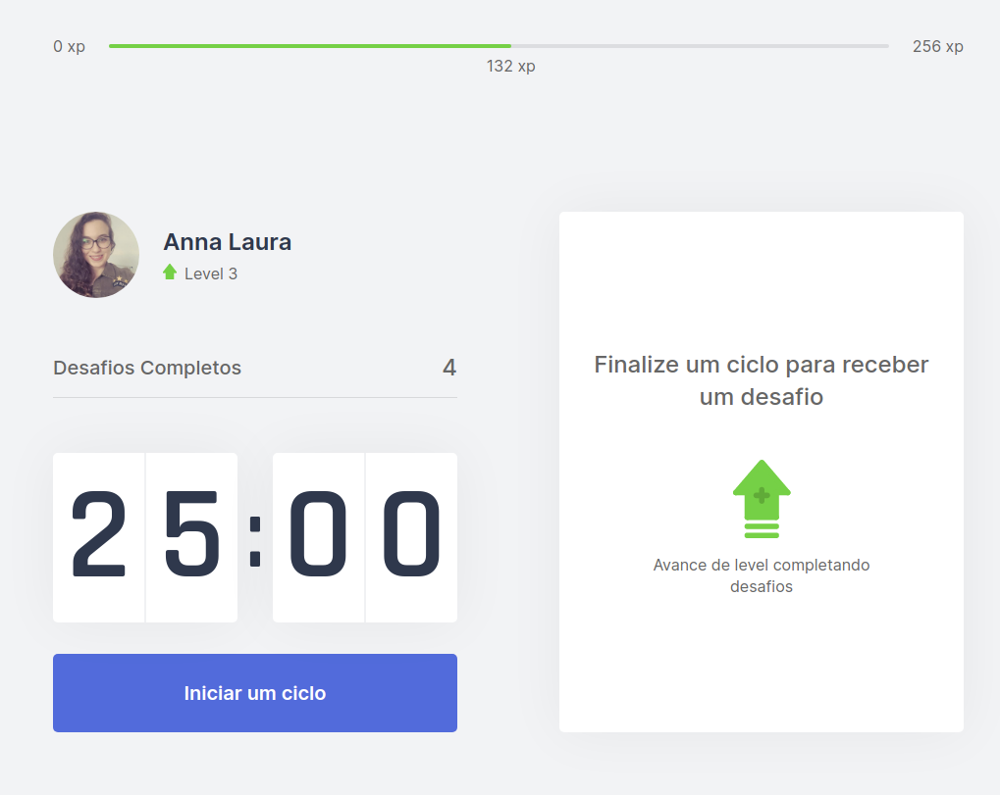

<h1 align="center">
    
</h1>

<h1 align="center" >move.it 1.0</h1>
<p align="center">
    <a href="README.md">English</a>
    ·
    <a href="README-pt.md">Portuguese</a>
 </p>

<p align="center">
  <a href="#computer-project">Project</a>&nbsp;&nbsp;&nbsp;|&nbsp;&nbsp;&nbsp;
  <a href="#rocket-technologies">Technologies</a>&nbsp;&nbsp;&nbsp;|&nbsp;&nbsp;&nbsp;
  <a href="#tada">Features</a>&nbsp;&nbsp;&nbsp;|&nbsp;&nbsp;&nbsp;
  <a href="#art">Layout</a>&nbsp;&nbsp;&nbsp;|&nbsp;&nbsp;&nbsp;
  <a href="#construction_worker-how-to-run">How to run</a>&nbsp;&nbsp;&nbsp;|&nbsp;&nbsp;&nbsp;
  <a href="#bulb">Coming Soon - move.it 2.0</a>&nbsp;&nbsp;&nbsp;|&nbsp;&nbsp;&nbsp;
  <a href="#handshake">Contribuing</a>&nbsp;&nbsp;&nbsp;|&nbsp;&nbsp;&nbsp;
  <a href="#closed_book-license">License</a>
</p>

## :computer: Project
Move.it is an application that uses the Pomodoro technique to encourage those who spend many hours at the computer to take breaks. At the end of each focused work cycle of 25 minutes, the person receives a small exercise challenge that aims to avoid injuries caused by long periods of time in the same position in front of computer.</br>

<strong>Project made in Next Level Week #4 @Rocketseat</strong>

### :eyes: Demo 

* https://moveit-al.vercel.app/
## :rocket: Technologies

* [ReactJS](https://reactjs.org/)
  
* [NextJS](https://nextjs.org/)

* [TypeScript](https://www.typescriptlang.org/)
  
* [Vercel](https://vercel.com/) - Deploy

## :tada: Features
* Pomodoro timer
* Small exercise challenges
* Score for completed challenges
* Level up progression

## :art: Layout and Screenshots

[Figma design](https://www.figma.com/file/D9nUtv8xVbuOl0pO9pf7Rz/Move.it-1.0-Copy-Copy?node-id=160%3A2761)

<p>
  
</p>
<p>
  
</p>

## :construction_worker: How to run
</br>

> To clone and run this application its necessary to have [Git](https://git-scm.com/) and [NodeJS](https://nodejs.org/en/) installed on your computer.

```bash
# Clone repository
$ git clone https://github.com/alauraivani/nlw4-moveit
```
```bash
# Go to the project folder
$ cd nlw4-moveit/

# Install Dependencies
$ yarn install

# Run the application in development mode
$ yarn dev
```

## :bulb: Move.it 2.0 - coming soon

* Responsive web design
* PWA
* Dark Theme
* Github OAuth
* Ranking page
* Share your level up on social media
* Notification improving
## :handshake: Contribuing

## :closed_book: License
This project is under the MIT license. See the file [LICENSE](LICENSE) for more details.

---
<div align="center">
  <sub>The NLW #4 project. Built with :heart: by
    <a href="https://github.com/alauraivani">Anna Laura</a> and
    <a href="https://github.com/alauraivani/nlw4-moveit/graphs/contributors">
      contributors
    </a>
  </sub>
</div>


